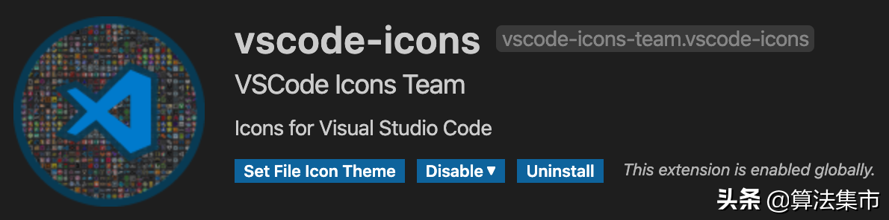

# VSCode 5个好用的插件

1、C/C++：C/C++开发者必备插件，提供代码提示、自动补全等功能；  
2、Bracket Pair Colorizer：对匹配的括号对进行着色，通过颜色看出括号的对应情况；  
3、GitLens：直观地看到代码git的提交记录；  
4、Vim：编辑神器；  
5、vscode-icons：将项目中不同类型的文件或文件夹通过图标区分，一目了然。

