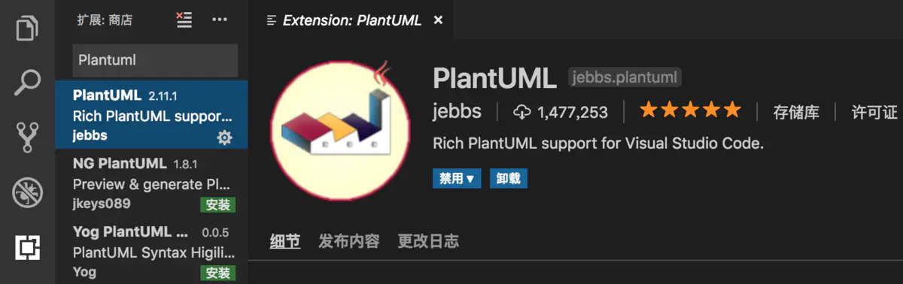
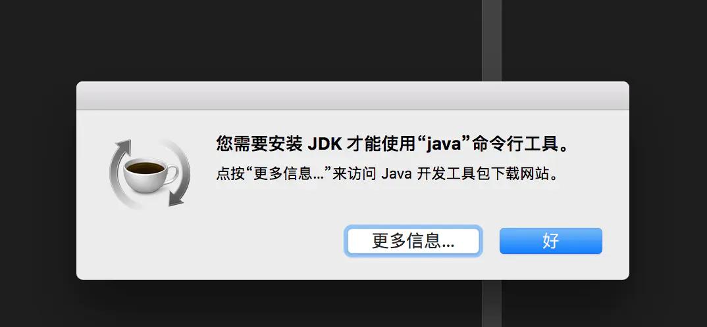
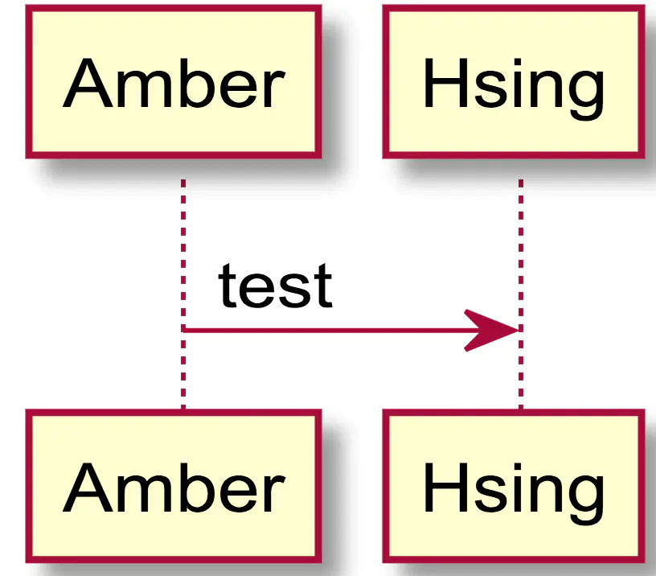
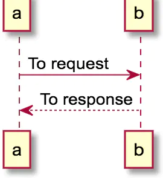
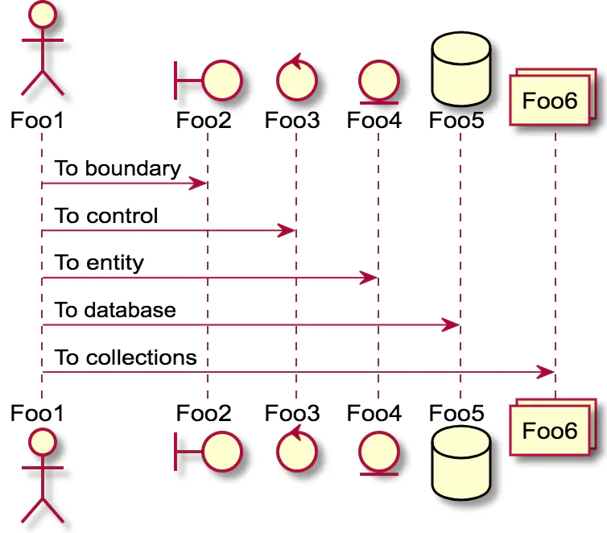
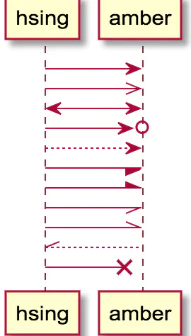
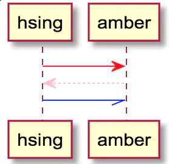

# vscode中plantuml的使用 #

**vscode中plantuml的使用**

在平时写文档中需要进行画图，hsing给我推荐了一个高效又简洁的工具--Plantuml。详细可参考文档http://plantuml.com/zh/

平时工作中使用的是vscode，所以在这里只介绍vscode中Plantuml的使用。

**1.在vscode的扩展商城中输入Plantuml， 点击进行安装。**



屏幕快照 2019-06-13 上午11.17.51.png

**2.在Plantuml中我们使用伪编程语言来生成图表。**

代码的文件的扩展名可以如一下：*.wsd, *.pu, *.puml, *.plantuml, *.iuml

**时序图**

```
@startuml
scale 3
Amber -> Hsing : test
@enduml
```

**按Alt+D或者Option+D可预览生成的图表**

注意如果你的电脑上没有安装java需要进行安装



屏幕快照 2019-06-13 上午11.23.48.png



屏幕快照 2019-06-13 下午12.14.59.png

可以使用 -->绘制虚线

```
@startuml
a -> b : To request
b --> a : To response
@enduml
```


屏幕快照 2019-06-14 下午3.45.05.png

**3.声明参与者**

关键字participant可以用于改变参与者的先后顺序。

角色分为：actor boundary control entity database

```
@startuml
actor Foo1
boundary Foo2
control Foo3
entity Foo4
database Foo5
collection Foo6
Foo1 -> Foo2 : To boundary
Foo1 -> Foo3 : To control
Foo1 -> Foo4 : To entity
Foo1 -> Foo5 : To database
Foo1 -> Foo6 : To collection
@enduml
```



屏幕快照 2019-06-13 下午12.30.45.png

使用关键字order自定义顺序打印参与者

```
@startuml
participant Last order 30
participant Middle order 20
participant First order 10
@enduml
```


屏幕快照 2019-06-14 下午4.00.43.png

**4.修改箭头的样式**

箭头样式有以下几种

- 表示一条丢失的消息：末尾加x
- 让箭头只有上半部分或者下半部分：将<和>替换成\或者/
- 细箭头：将箭头标记写成两次（如>> 或 //）
- 虚线箭头： 用--替代 -
- 箭头末尾加圈：->o
- 双向箭头： <->

```
@startuml
hsing -> amber
hsing ->> amber
hsing <-> amber
hsing ->o amber
hsing --> amber
hsing -/ amber
hsing -\ amber
hsing -// amber
hsing -\\ amber
hsing //-- amber
hsing ->x amber
@enduml
```



屏幕快照 2019-06-14 下午4.29.41.png

**5.修改箭头的颜色**

使用记号修改箭头颜色

```
@startuml
hsing -[#red]> amber
amber -[#pink]-> hsing
hsing -[#blue]// amber
@enduml
```



屏幕快照 2019-06-14 下午4.33.44.png

作者：Amber貝貝

链接：https://www.jianshu.com/p/5c7bc062aa2b

来源：简书

著作权归作者所有。商业转载请联系作者获得授权，非商业转载请注明出处。